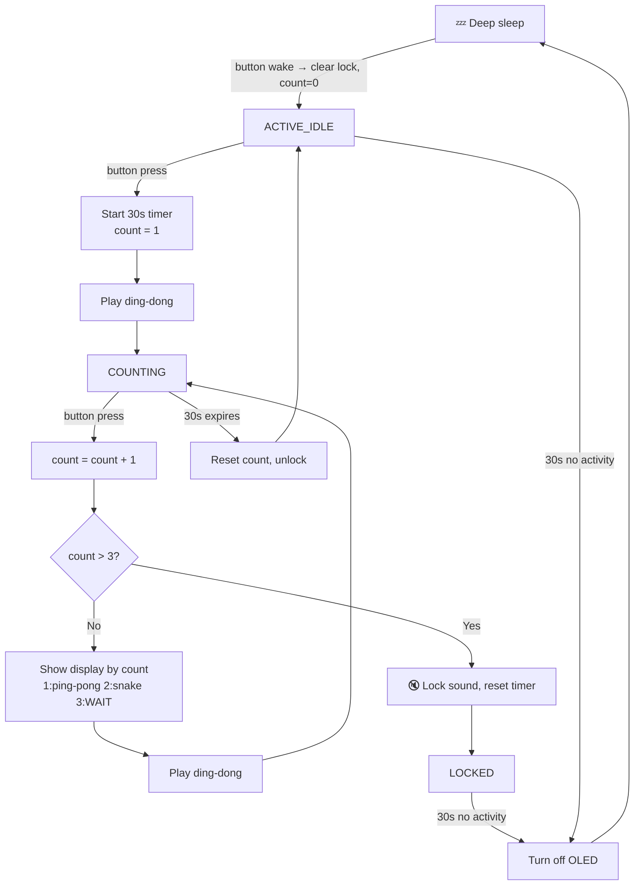

# Anti-Rage Doorbell (real-time, Arduino MCU)

## Goal
A doorbell that discourages rage-ringing: after 3 presses within 30s it locks
the sound. An OLED shows escalating "brainrot" displays. After 30s of no
activity it sleeps, waking only on the next press.

## Hardware
- ESP32 dev board (needed for wake-on-button deep sleep)
- Push button (doorbell)
- Buzzer / speaker (the "ding-dong")
- OLED SSD1306 128x64, I2C

## Wiring
| Component   | ESP32 pin        | Notes                          |
|-------------|------------------|--------------------------------|
| Button      | GPIO (RTC-capable, e.g. 33) | needed for ext0 deep-sleep wake |
| Buzzer      | any GPIO (e.g. 25)          |                                |
| OLED SDA    | GPIO 21          | I2C default                    |
| OLED SCL    | GPIO 22          | I2C default                    |

## State machine
States: ACTIVE_IDLE, COUNTING, LOCKED, SLEEP (diagram below).

## Display implementation

v1 displays (ping-pong, snake) are **hardcoded bitmap animation frames** — converted to byte
arrays at build time, stored in firmware flash (PROGMEM), played back as a simple loop via
Adafruit_GFX. No file storage needed; matches the OLED-only hardware list below.

## Milestones
1. Button press → buzzer sounds (with debounce)
2. Count presses in a 30s window; lock sound after 3
3. OLED: show display by hit count (1=ping-pong, 2=snake, 3="WAIT"); each display still plays the ding-dong — sound only stops once the 3-hit lock engages
4. Reset count + unlock when the 30s window expires
5. After 30s idle → deep sleep; wake on button press clears the lock and starts fresh in ACTIVE_IDLE (count = 0, sound unlocked)

## Stretch goals (only if time allows, not required for v1)
- Replace the hardcoded bitmap loops with actual playable mini-games (ping-pong, snake) rendered
  live on the OLED, controlled by the same button.
- Alternate hardware variant: swap the OLED for the 2.2" color LCD + microSD (already in the
  parts inventory) to support real `.gif` file playback instead of hardcoded frames.

