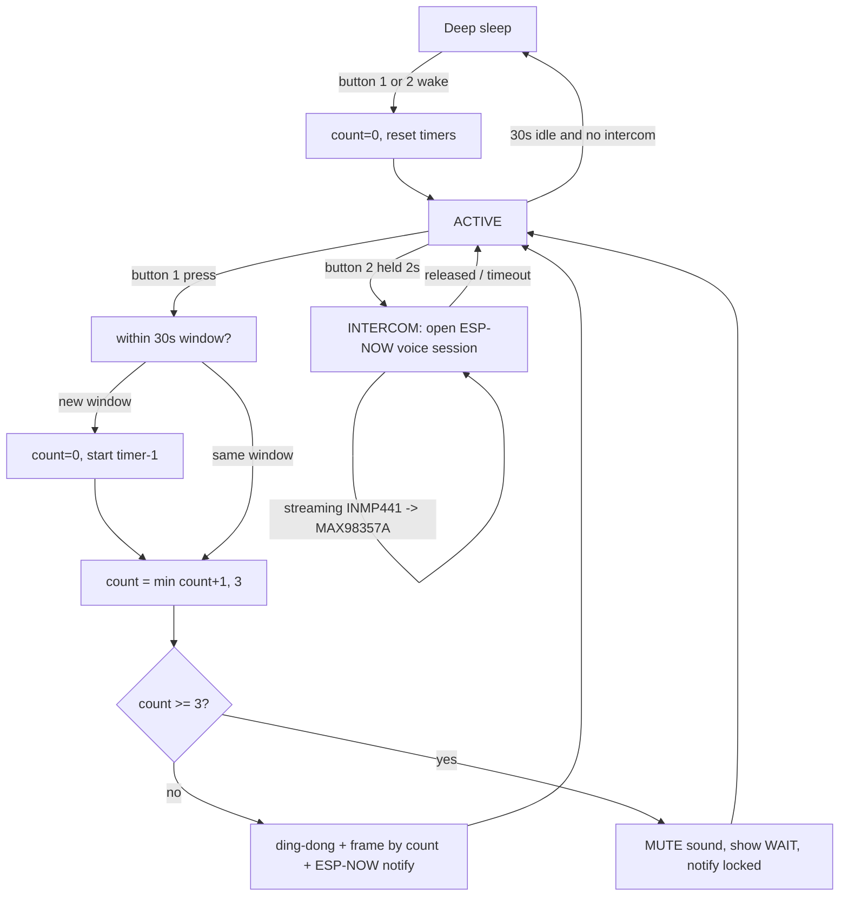

# Anti-Rage Doorbell + Intercom (two-node, ESP-NOW)

## Goal
A doorbell that discourages rage-ringing **and** doubles as a push-to-talk intercom
across a wall. Two ESP nodes talk over **ESP-NOW** (no router, no cloud):

- **Button 1 — doorbell.** After 3 presses inside a 30 s window it locks the sound; an
  OLED escalates through "brainrot" frames. 30 s idle → deep sleep, wake on the next press.
- **Button 2 — intercom.** Hold 2 s to open an ESP-NOW voice session: the INMP441 mic on
  one side streams to the MAX98357A amp on the other ("voice to the other end"), half-duplex,
  until the button is released or the session times out.

> This README is the **living spec**. It was reconciled against the four design diagrams in
> [`img/`](img/) (system overview, whole workflow, button logic, voice logic), which describe a
> larger system than the original single-board sketch. See **Open decisions** at the bottom for
> the points still worth your call.

## Nodes (hardware-sharing policy: one MCU pair, built one project at a time)

| Node | Board | Role | Peripherals |
|------|-------|------|-------------|
| **Door panel** | Arduino Nano ESP32 (ESP32-S3) | The capable side: buttons, sound, screen, sleep/wake, mic | Button 1, Button 2, passive buzzer (v1) → MAX98357A+INMP441 (v2), OLED SSD1306 |
| **Indoor chime** | ESP8266MOD | The "other end": receives doorbell + voice, plays them | Buzzer (v1) → MAX98357A (v2), optional talk-back button+mic |

**Why this split:** the ESP32-S3 has the RAM/flash, dual I²S, RTC-GPIO deep-sleep wake, and
crypto the design needs; the ESP8266's one strong audio path is I²S *output* (playing received
voice). Heavy work lives on the S3; the 8266 is the lightweight chime/speaker.

## Wiring — Door panel (Nano ESP32 / ESP32-S3)

> **Full step-by-step wiring for both nodes** — parts list, per-component hookups, pin-audit
> tables, power/ground rules, and a bring-up order — is in **[WIRING.md](WIRING.md)**. The table
> below is the quick reference.

> Pins below are **raw GPIO numbers** (what the deep-sleep + I²S APIs need). Verify each against
> your Nano ESP32 silkscreen (D0–D13 / A0–A7) before wiring — see [`include/config.h`](include/config.h).

| Signal | GPIO | Notes |
|--------|------|-------|
| Button 1 (doorbell) | 5 | **active-HIGH** to 3V3, external pull-down, RTC-capable → wakes from deep sleep |
| Button 2 (intercom) | 6 | **active-HIGH** to 3V3, external pull-down, RTC-capable → wakes from deep sleep |
| Buzzer (v1 ding-dong) | 7 | passive buzzer via LEDC tone |
| OLED SDA / SCL | Wire default (A4 / A5) | SSD1306 128×64 @ I²C 0x3C |
| INMP441 mic (I²S RX) | SD 8 (D5) · WS 9 (D6) · SCK 10 (D7) | milestone 3 (voice) |
| MAX98357A amp (I²S TX) | DIN 21 (D10) · LRC 18 (D9) · BCLK 17 (D8) | milestone 3 — replaces the buzzer; kept clear of the OLED's I²C pins |

> **Pin numbering:** the `door_panel` build forces raw-GPIO mode (`-DBOARD_USES_HW_GPIO_NUMBERS`)
> so the firmware's pin numbers and the deep-sleep wake mask agree. Numbers above are **raw GPIO**;
> the `(Dx)` in parentheses is the Nano ESP32 silkscreen pin to physically wire to.

⚠️ **Deep sleep on the S3:** the ESP32-S3 has **no `ext0`**, and this toolchain (arduino-esp32
2.0.17 / IDF 4.4) has no deep-sleep GPIO wake — so the firmware wakes via **`ext1` in `ANY_HIGH`
mode**. That dictates **active-high buttons**: idle LOW through an **external pull-down resistor**,
pressed pulls to 3V3. (Internal pulls aren't guaranteed held across deep sleep, hence external.)
This corrects the classic-ESP32 `ext0`/GPIO 21/22/33 plan from the old draft. *Verified: the
`door_panel` env compiles clean against this exact toolchain.*

## Wiring — Indoor chime (ESP8266)
Buzzer on GPIO14 (D5) for v1. The ESP8266 I²S-out pins are fixed (BCLK=GPIO15, WS=GPIO2,
DATA=GPIO3/RX) for the MAX98357A in milestone 3.

## State machine (merged button + voice logic)



## ESP-NOW protocol
Shared wire format lives in [`include/protocol.h`](include/protocol.h) (both nodes must agree):
- `MSG_DOORBELL` — press count + locked flag + sequence number.
- `MSG_VOICE_BEGIN / _CHUNK / _END` — half-duplex PCM. ESP-NOW caps payload at 250 B, so voice
  is 8 kHz / 16-bit mono packed ~110 samples (220 B) per packet. **v1 defines the packets;
  live streaming is milestone 3.** Both nodes are locked to `ESPNOW_CHANNEL` (interop between
  ESP32-S3 and ESP8266 requires a fixed shared channel).

## Milestones (staged so v1 flashes today)
- **M0 — scaffold** ✅ two-env PlatformIO, shared `config.h`/`protocol.h`, both nodes build.
- **M1 — doorbell core** ✅ (door panel) button debounce, GPIO deep-sleep wake, 30 s press
  window, counter + 3-press lockout, ding-dong via buzzer, OLED frames.
- **M2 — link** ✅ door panel broadcasts `MSG_DOORBELL`; indoor chime beeps + logs it.
- **M3 — intercom (the hard 20%)** ⏳ INMP441 → ESP-NOW → MAX98357A, PTT half-duplex.
  Protocol + I²S pins defined; streaming loop is scaffolded and needs on-hardware tuning.
- **M4 — polish (stretch)** ⏳ real color GIFs on the 2.2" LCD + microSD instead of OLED frames;
  talk-back mic on the indoor node.

## Firmware layout
```
platformio.ini          two envs: door_panel (ESP32-S3), indoor_chime (ESP8266)
include/config.h        pins + timing, shared
include/protocol.h      ESP-NOW message structs, shared
src/door_panel/main.cpp Nano ESP32 firmware (M1+M2 working, M3 scaffold)
src/indoor_chime/main.cpp ESP8266 firmware (M2 working, M3 scaffold)
```
Build the door panel: `pio run -e door_panel` · flash: `pio run -e door_panel -t upload`.
The `indoor_chime` env needs the ESP8266 platform first: `pio pkg install -e indoor_chime`.

## Open decisions (your call — cheap to change)
1. **Node roles** — is the Nano ESP32 the *door/outdoor* panel and the ESP8266 the *indoor*
   unit, or reversed? (Firmware core is symmetric; only labels/wiring move.)
2. **Screen** — OLED SSD1306 with hardcoded frames (assumed for v1) vs. the 2.2" color LCD +
   microSD for real GIF playback (the diagrams' "GIF#3 / preset map"). v1 uses the OLED.
3. **Intercom duplex** — half-duplex PTT (assumed, cheap on ESP8266) vs. full-duplex (needs a
   working mic path on the ESP8266, which is marginal).
4. **Exact GPIO/silkscreen mapping** on the Nano ESP32 — confirm the pins in `config.h`.
```
