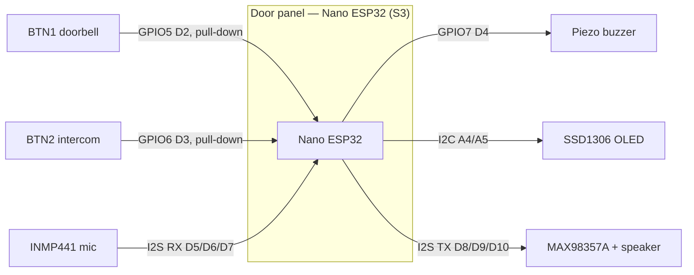

# Wiring Guide — Anti-Rage Doorbell + Intercom

How to physically wire both nodes. Pin numbers here match [`include/config.h`](include/config.h)
and are **verified** against the Arduino Nano ESP32 board variant and the compiled firmware.

> **The two nodes are electrically independent.** Nothing crosses the wall — the door panel and
> the indoor chime are separate circuits with separate power, linked *only* by ESP-NOW radio. Wire
> and power each one on its own. There is **no** wire between them.

> **Read this first — Nano ESP32 pin numbering.** This board can number pins two ways ("D2" vs
> raw "GPIO5"). The firmware forces **raw-GPIO mode** (`-DBOARD_USES_HW_GPIO_NUMBERS`). Every pin
> below is written as **`GPIO<n> (silk Dx)`** — the GPIO is what the code uses; the **`Dx` is the
> header pin you actually push a wire into**. Wire to the silkscreen label.

---

## 1. Parts you need beyond the two boards

| Qty | Part | For | Milestone |
|----:|------|-----|:--------:|
| 2 | Momentary push buttons | doorbell + intercom | M1 |
| 2 | 10 kΩ resistor | button pull-downs (one per button) | M1 |
| 1 | Passive piezo buzzer | door-panel ding-dong | M1 |
| 1 | Passive buzzer | indoor chime | M2 |
| 1 | OLED SSD1306 128×64, I²C | brain-rot screen | M1 |
| 1 | INMP441 I²S MEMS mic | intercom capture | M3 |
| 2 | MAX98357A I²S amp breakout | intercom playback (one per node) | M3 |
| 2 | Speaker, 4–8 Ω, ~3 W | amp output (one per node) | M3 |
| — | 0.1 µF + 10 µF caps | decoupling, one pair per powered module | all |
| — | Breadboard + jumper wires | | all |
| opt | 2N3904 NPN + 1 kΩ + 1N4148 | transistor driver if you use a *loud* buzzer/speaker for the ding | M1 |

A bare **piezo** passive buzzer (a few mA) can be driven straight from a GPIO. A louder magnetic
buzzer or a small speaker needs the transistor driver (§6).

---

## 2. Door panel — Arduino Nano ESP32 (ESP32-S3)

### 2.1 Power rails
- Power the board over **USB-C** (also your programming + serial port).
- Feed the breadboard **`+3V3` rail** from the Nano's **3V3** pin, and the **GND rail** from any **GND** pin.
- The MAX98357A wants more current — see §2.6 for its power.

### 2.2 Buttons — ACTIVE-HIGH with pull-downs (required for deep-sleep wake)

The S3 wakes from deep sleep via **ext1 → ANY_HIGH**, so a press must drive the pin **HIGH**. Each
button connects **+3V3 → button → GPIO**, with a **10 kΩ pull-down from the GPIO to GND** so the
pin sits LOW when released.

```
        +3V3 ──────┐                     +3V3 ──────┐
                   │                                │
                 [ BTN1 ]                         [ BTN2 ]   (momentary)
                   │                                │
   GPIO5 (D2) ─────┼───────┐         GPIO6 (D3) ────┼───────┐
                           │                                │
                        [10kΩ]                           [10kΩ]
                           │                                │
        GND ───────────────┘         GND ─────────────────┘
```

- **BTN1 (doorbell)** → **GPIO5 (silk D2)**
- **BTN2 (intercom)** → **GPIO6 (silk D3)**
- Both D2/D3 are RTC-capable, so both can wake the board.
- Use an **external** 10 kΩ pull-down (not just the internal one): internal pulls aren't guaranteed
  to hold through deep sleep on the S3.

### 2.3 Buzzer (v1 ding-dong)
- Buzzer **`+`** → **GPIO7 (silk D4)**
- Buzzer **`−`** → **GND**
- Piezo passive buzzer: direct is fine. For a loud one, use the driver in §6 off the same GPIO7.

### 2.4 OLED SSD1306 (I²C)
| OLED pin | Nano pin |
|----------|----------|
| VCC | 3V3 |
| GND | GND |
| SDA | **GPIO11 (silk A4)** — default I²C SDA |
| SCL | **GPIO12 (silk A5)** — default I²C SCL |

- I²C address **0x3C** (a few modules are 0x3D — change it in `oled.begin(..., 0x3C)` if blank).
- Most modules have onboard 4.7 kΩ pull-ups. If yours doesn't, add 4.7 kΩ from SDA and SCL to 3V3.

### 2.5 INMP441 microphone — I²S RX (milestone 3)
| INMP441 | Nano pin | Note |
|---------|----------|------|
| VDD | 3V3 | |
| GND | GND | |
| L/R | GND | selects the left channel (tie low) |
| WS  | **GPIO9 (silk D6)** | word-select / LRCL |
| SCK | **GPIO10 (silk D7)** | bit clock |
| SD  | **GPIO8 (silk D5)** | data OUT of mic → INTO the ESP |

### 2.6 MAX98357A amplifier — I²S TX (milestone 3)
Pins are kept **clear of the OLED's I²C** (that's why they're not 11/12).
| MAX98357A | Nano pin | Note |
|-----------|----------|------|
| Vin | **3V3** (or 5V for more volume — see below) | |
| GND | GND | |
| DIN | **GPIO21 (silk D10)** | audio data |
| BCLK| **GPIO17 (silk D8)** | bit clock |
| LRC | **GPIO18 (silk D9)** | word select |
| GAIN| leave floating | ≈9 dB default; tie to set other gains |
| SD  | leave floating | board default = (L+R)/2, amp **on**. Tying SD→GND = **shutdown**, don't. |
| **+ / −** | **speaker** | bridge-tied — do **NOT** ground the speaker `−` |

- **Volume:** `Vin = 3V3` works and is simplest. For louder, use **5V** — but the Nano ESP32's
  `5V` header pin is **disconnected by default** (bridge the board's 5V solder jumper, or feed 5V
  from an external supply sharing GND). Start at 3V3 for bring-up.
- The mic (I²S RX, `I2S_NUM_0`) and amp (I²S TX, `I2S_NUM_1`) use **separate** I²S peripherals, so
  full/half-duplex audio is fine — that's why they don't share clock pins.

### 2.7 Door-panel pin audit
| GPIO (silk) | Connects to | Signal | Dir | Idle state | Notes |
|-------------|-------------|--------|-----|-----------|-------|
| GPIO5 (D2)  | BTN1 doorbell | digital | in | LOW (pull-down) | RTC wake; active-HIGH |
| GPIO6 (D3)  | BTN2 intercom | digital | in | LOW (pull-down) | RTC wake; active-HIGH |
| GPIO7 (D4)  | Buzzer + | LEDC tone | out | LOW | direct piezo / transistor for loud |
| GPIO11 (A4) | OLED SDA | I²C | bidir | HIGH (pull-up) | shared bus |
| GPIO12 (A5) | OLED SCL | I²C | out | HIGH (pull-up) | shared bus |
| GPIO8 (D5)  | INMP441 SD | I²S data | in | — | M3 |
| GPIO9 (D6)  | INMP441 WS | I²S WS | out | — | M3 |
| GPIO10 (D7) | INMP441 SCK| I²S BCLK| out | — | M3 |
| GPIO21 (D10)| MAX98357A DIN | I²S data | out | — | M3 |
| GPIO18 (D9) | MAX98357A LRC | I²S WS | out | — | M3 |
| GPIO17 (D8) | MAX98357A BCLK| I²S BCLK| out | — | M3 |



---

## 3. Indoor chime — ESP8266 (NodeMCU)

### 3.1 Buzzer (milestone 2 — wire this now)
- Buzzer **`+`** → **GPIO14 (silk D5)**
- Buzzer **`−`** → **GND**
- Power the NodeMCU by USB; take logic power from its **3V3** pin.

### 3.2 MAX98357A on the chime — I²S OUT (milestone 3)
The ESP8266's I²S output pins are **fixed** — you cannot move them:
| MAX98357A | ESP8266 pin | Boot caveat |
|-----------|-------------|-------------|
| Vin | **VIN / 5V** (USB 5V) | 5V for volume; 3V3 also works |
| GND | GND | |
| BCLK| **GPIO15 (silk D8)** | D8 must be LOW at boot — fine, amp input is hi-Z |
| LRC | **GPIO2 (silk D4)** | D4 must be HIGH at boot — fine, amp input is hi-Z |
| DIN | **GPIO3 (silk RX)** | uses the RX pin → you lose serial-in; serial *print* still works |
| SD  | floating | amp on; SD→GND = shutdown |

Because DIN steals RX, flash/serial-debug the chime **before** connecting the amp's DIN, or leave
DIN off until you need audio.

### 3.3 Chime pin audit
| GPIO (silk) | Connects to | Signal | Dir | Notes |
|-------------|-------------|--------|-----|-------|
| GPIO14 (D5) | Buzzer + | tone | out | M2 |
| GPIO15 (D8) | MAX98357A BCLK | I²S | out | fixed pin; LOW at boot |
| GPIO2 (D4)  | MAX98357A LRC | I²S | out | fixed pin; HIGH at boot |
| GPIO3 (RX)  | MAX98357A DIN | I²S | out | fixed pin; conflicts w/ serial-in |

---

## 4. Power & grounding

- **One GND rail per node**, and tie every module's GND to it (a single **star point** at the
  board's GND pin). Don't daisy-chain grounds through modules.
- **Decouple every powered module**: 0.1 µF **and** 10 µF from its VCC to GND, physically close to
  the module. The MAX98357A especially — audio draws current in spikes.
- The amp is the only "noisy" load here (no motors/mains in this project). Keep its power and
  speaker leads short; run the speaker return straight back to the star ground, not through the
  logic breadboard rows.
- Never back-power a board: if you use an external 5V for the amps, tie its GND to the board GND but
  do **not** also feed 5V into the board's 3V3 rail.

## 5. Bring-up order (test as you wire — don't wire everything then debug)

1. **Board alone** — USB in, `pio run -e door_panel -t upload -t monitor`; confirm the boot log.
2. **OLED** — add it; on cold boot the screen should show the idle frame (no "OLED init failed").
3. **BTN1** — add button + pull-down; each press logs `Doorbell press #n` and dings.
4. **Buzzer** — confirm the two-tone ding-dong; press 3× within 30 s → sound mutes, screen shows `WAIT`.
5. **Deep sleep** — wait 30 s idle → `Sleeping...`; a press wakes it and counts as hit #1.
6. **Chime link** — flash the ESP8266 (`pio pkg install -e indoor_chime` first); a doorbell press
   should beep the chime and log the event on its serial.
7. **(M3) Audio** — mic + amps last; verify I²S clocks on a scope/logic analyzer before expecting sound.

## 6. Optional: transistor driver for a loud buzzer/speaker
For a magnetic buzzer or a small speaker on the ding (instead of a piezo), don't drive it from the
GPIO directly:
```
   GPIO7 (D4) ──[1kΩ]──┤ base    NPN 2N3904
                       │ collector ── buzzer(−)      buzzer(+) ── +5V
                       │ emitter  ── GND
   flyback: 1N4148 across the buzzer (cathode → +5V) for inductive (magnetic) types
```

## 7. Common gotchas
- **Wrong pin because of remap** — if a button seems dead or the board wakes on the wrong pin, the
  build lost `-DBOARD_USES_HW_GPIO_NUMBERS`. Confirm it's in `platformio.ini`.
- **Board won't wake** — you wired a button active-LOW. This design is **active-HIGH** (press → 3V3);
  re-check the pull-down orientation.
- **OLED blank** — wrong I²C address (try 0x3D) or missing bus pull-ups.
- **Amp silent** — `SD` pulled to GND (that's shutdown), or speaker `−` tied to GND (it's bridge-tied).
- **Chime won't boot with amp attached** — DIN on RX (GPIO3) or a pull-up on D8/D4; disconnect audio
  pins, boot, then reconnect.
